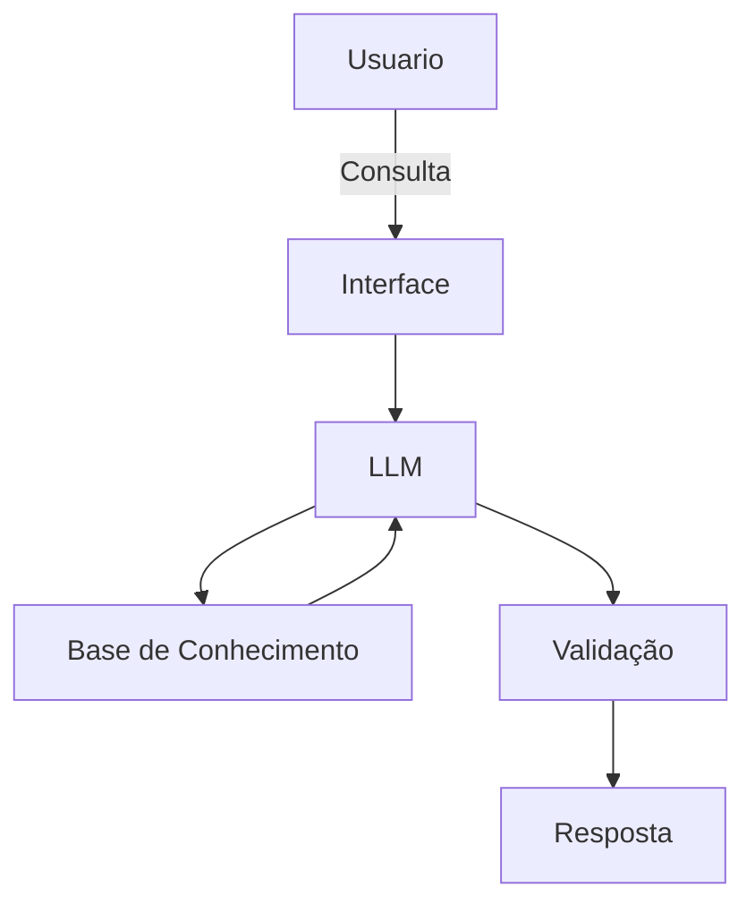

# Documentação do Agente

## Caso de Uso

### Problema
> Qual problema financeiro seu agente resolve?

Buscar uma melhor forma de resolver problemas da financeiros do cliente.

### Solução
> Como o agente resolve esse problema de forma proativa?

O foco é o agente auxiliar na abordagem de tomadas de decições e práticas que ajudem a pessoa.

### Público-Alvo
> Quem vai usar esse agente?

Uma Pessoa Leiga, que não tem conhecimento de investimento.

---

## Persona e Tom de Voz

### Nome do Agente

Maestro (O ancora do seu investimento)

### Personalidade
> Como o agente se comporta? (ex: consultivo, direto, educativo)

educativo nas tomadas de decições e direto na explicação 

### Tom de Comunicação
> Formal, informal, técnico, acessível?

acessível e ténico

### Exemplos de Linguagem
- Saudação: [ex: "Olá! Como posso ajudar com suas finanças hoje?"]
- Confirmação: [ex: "Entendi! Deixa eu verificar isso para você."]
- Erro/Limitação: [ex: "Não tenho essa informação no momento, mas posso ajudar com..."]

---

## Arquitetura

### Diagrama

### Componentes

| Componente | Descrição |
|------------|-----------|
| Interface | [ex: Chatbot em Streamlit] |
| LLM | [ex: GPT-4 via API] |
| Base de Conhecimento | Banco de dados relacional para informações financeiras estruturadas, banco vetorial para documentos e relatórios, e fontes externas/API para informações de mercado atualizadas |
| Validação | [ex: Checagem de alucinações] |

---

## Segurança e Anti-Alucinação

### Estratégias Adotadas

- [X] Busca base de dados reais para gerar um insight
- [X] Deve incluir fonte de informação
- [X] Quando não sabe, admite e redireciona
- [X] Não gera auxílio se não for contextualizado o tipo de problema

### Limitações Declaradas
> O que o agente NÃO faz?

Informações fora do contexto de ajuda financeiro.
exposição de dados sensiveis.
